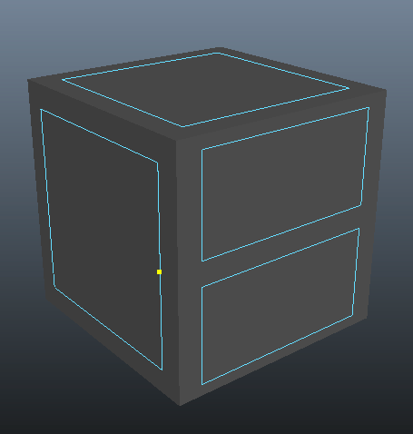
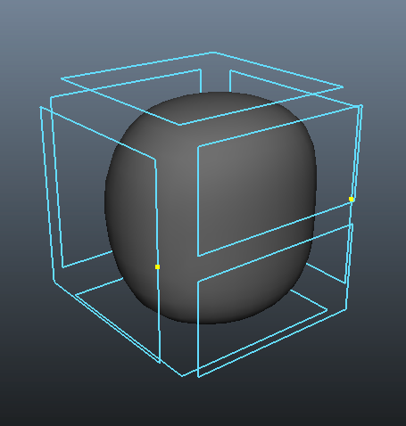

# MayaTSubdiv
Maya-Plugin with example implementation of the Siggraph 2015 paper "Dyadic T-mesh Subdivision"

# Installation

(developed on Xcode 6 / Maya 2014).

The plugin consists of a DAG node called `TCCNode` and two commands `resetVtxRemapCmd` and `updateTCCDataCmd` that help keep things in sync through topological edits etc.

There are several python scripts that support modelling with T-meshes.

 1. Copy `Shelf_TCC.mel` to `shelves/` in your Maya preferences folder (e.g. `~/Library/Preferences/Autodesk/maya/2014-x64/prefs`).
 2. Copy the custom icons to `icons/` in your Maya preferences folder.
3. Compile the three projects and point Maya to the three plugin bundles. Make sure all three are loaded in Maya.
4. add the python script folder to your Maya python path, and make sure all `*Cmd.py` files are loaded in Maya.

# Quick Tutorial
1. Find the `TCC` shelf in your Maya Shelf bar, and click the cube icon all the way on the left:

	

	A cube is inserted into your 3D scene:

	

2. Click on the interactive split tool...

	

	... and insert a single edge across a face:

	

3. Click the sphere icon in the shelf to create a T-mesh subdivision node. 

	

	It will create a new shape `TCC_pCube1` with the evaluated T-mesh subdivision mesh.

	

4. Right-click and select vertex-face mode...

	

	
	
	... and select the two T-vertices.

	

	Click on the `Recycle` icon to update the TCC topology

	

	

6. Select the subdivided mesh

	

    In the Attribute Editor, find the `TCC1` node's tab...

	

    and change the `Subdivision Resolution` from 3 to 5.

	
